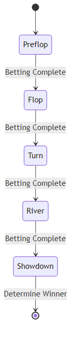

# 🎰 텍사스 홀덤 포커 게임

알고리즘을 활용한 AI 대전 시스템 구현 프로젝트

## 📋 프로젝트 개요

2025년 2학기 알고리즘 수업 팀 프로젝트로, 다양한 알고리즘을 활용하여 완전한 텍사스 홀덤 포커 게임을 구현합니다.

**팀원**: 문현준, 박성결, 박종호, 박우현
**개발 기간**: 10주 (전반부 3~7주차, 후반부 9~14주차)

## 🎯 프로젝트 목표

### 학습 목표

- 수업에서 배운 알고리즘을 실제 프로젝트에 적용
- 복잡한 게임 로직을 알고리즘으로 해결
- 다양한 난이도의 인공지능 구현
- 팀 프로젝트를 통한 실무 협업 능력 향상

### 기대 성과

- **10주** 남은 개발 주차
- **4명** 팀원 협력
- **3단계** AI 난이도 구현
- **6개** 핵심 알고리즘 활용

## ⚡ 주요 기능

### 필수 기능

- **🎯 완전한 포커 게임**: 프리플롭부터 리버까지 모든 라운드
- **🤖 2단계 AI 시스템**: 규칙 기반 타이트/루즈 AI
- **💰 완벽한 베팅 시스템**: Check, Call, Raise, Fold, All-in
- **👥 2인 온라인 대전**: WebSocket 기반 실시간 대전 (구현 완료)
- **🌐 웹 인터페이스**: FastAPI 및 WebSocket을 활용한 반응형 웹 게임 환경
- **📊 시뮬레이션 도구**: 몬테카를로 승률 계산기 및 미니맥스 알고리즘 (실험적)

### AI 난이도별 특징

#### Level 1: 타이트 플레이어 (Tight Strategy)

- 프리미엄 핸드 위주로 플레이
- 보수적 베팅 전략
- 블러핑 최소화
- 예측 가능한 패턴

#### Level 2: 루즈 어그레시브 (Loose Strategy)

- 넓은 범위의 핸드로 참여
- 공격적 베팅 및 블러핑
- 팟 오즈와 포지션을 적극 활용
- 예측이 더 어려운 패턴

#### Level 3: 적응형 AI (Adaptive Strategy)

- 상대 스타일 분석 (Tight/Loose)
- 동적 전략 변경
- 몬테카를로 시뮬레이션 기반 승률 계산
- 미니맥스 알고리즘 (실험적 구현, 통합 예정)

### 추가 기능 (계획)

- **토너먼트 모드**: 여러 AI가 경쟁하는 라운드 로빈 방식
- **통계 분석**: 승률, 수익률, 핸드별 성과 분석
- **디버그 모드**: 카드 공개, AI 사고 과정 표시
- **웹 게임 모드**: 브라우저를 통한 그래픽 인터페이스 제공

## 🔧 실행 방법

```bash
# 프로젝트 클론
git clone https://github.com/ParkSeongGyeol/Texas-holdem.git
cd Texas-holdem

# 가상환경 생성 및 활성화
python -m venv venv
source venv/bin/activate  # Linux/Mac
# venv\Scripts\activate   # Windows

# 의존성 설치 (개발용)
pip install -e .[dev]

# 게임 실행 (콘솔 모드)
python src/main.py

# 웹 서버 실행 (웹 모드)
python src/web/app.py
# 브라우저에서 http://localhost:8000 접속

# 시뮬레이션 실행
python src/algorithms/monte_carlo.py

# 테스트 실행
pytest tests/

# 코드 스타일 검사
black src/
flake8 src/
```

## 🏗️ 코드 구조 및 흐름 (Code Structure & Flow)

프로젝트의 전체적인 구조와 흐름을 이해하기 위한 시각적 자료입니다.

### 프로젝트 구조도 (Project Architecture)

프로젝트의 전체적인 구조와 데이터 흐름을 보여주는 아키텍처 다이어그램입니다.

```mermaid
graph TD
    User["User / Client"] --> Main["Main Entry (main.py)"]
    
    subgraph "Core System"
        Main --> Game["PokerGame"]
        Game --> Player["Player"]
        Game --> Deck["Deck"]
        Player --> Card["Card"]
    end
    
    subgraph "Algorithms"
        Player --> HandEval["Hand Evaluator"]
        AI --> MonteCarlo["Monte Carlo Sim"]
        AI --> Minimax["Minimax"]
    end
    
    subgraph "AI System"
        Player <|-- AI["AI Player"]
        AI --> Strategy["Betting Strategies"]
    end
    
    subgraph "Web Interface (Implemented)"
        User --> API["FastAPI Server"]
        API --> Game
    end
```

### 게임 진행 흐름도 (Game Flow Diagram)

게임은 프리플롭에서 시작하여 쇼다운까지 단계별로 진행됩니다. 각 단계 사이에는 베팅 라운드가 존재합니다.



## 🚀 다음 단계 및 코드 읽기 가이드 (Next Steps)

현재 `Player` 클래스와 `HandEvaluator`가 연결되어, 플레이어가 자신의 핸드 강도를 계산할 수 있게 되었습니다.

### 1. 연결 고리 이해하기
- **`src/core/player.py`**: `get_hand_strength(community_cards)` 메서드는 `HandEvaluator`를 호출하여 0.0 ~ 1.0 사이의 점수를 반환합니다.
- **`src/algorithms/hand_evaluator.py`**: 5~7장의 카드를 받아 최적의 족보를 판정합니다.

### 2. 남은 개발 항목 (우선순위)
1. **AI 의사결정 로직 (`src/ai/`)**: `Player.get_hand_strength`를 활용하여 AI가 베팅(Call/Fold/Raise)을 결정하는 로직을 구현해야 합니다. (박종호님 담당)
2. **게임 루프 통합 (`src/core/game.py`)**: 게임 진행 중 각 단계(Flop, Turn, River)마다 플레이어의 액션을 요청할 때, AI 플레이어는 위 로직을 사용해야 합니다.

### 3. 코드 읽기 순서 추천 (Newcomer Guide)

프로젝트를 처음 접하는 분들은 다음 순서로 코드를 읽는 것을 추천합니다.

1.  **`src/main.py`**: 프로그램의 진입점입니다. `PokerGame` 객체가 어떻게 생성되고 실행되는지 확인하세요.
2.  **`src/core/game.py`**: 게임의 전체 흐름(`new_hand` -> `betting_round` -> `advance_phase`)을 파악하세요. 위 흐름도를 참고하면 좋습니다.
3.  **`src/core/player.py`**: 플레이어의 상태 관리와 `get_hand_strength` 메서드를 확인하세요.
4.  **`src/algorithms/hand_evaluator.py`**: 포커 족보 판정 로직의 세부 구현을 살펴보세요.
5.  **`tests/verify_hand_strength.py`**: 실제 코드가 어떻게 동작하는지 테스트 스크립트를 통해 확인하세요.

## 🧮 핵심 알고리즘

| 알고리즘         | 용도            | 특징                          |
| ---------------- | --------------- | ----------------------------- |
| **조합론**       | 7장 중 5장 선택 | C(7,5) = 21, 최상의 패 조합 탐색 (구현 완료) |
| **비트마스킹**   | 족보 판정       | O(1) 족보 판정, 메모리 효율성 (계획) |
| **몬테카를로**   | 승률 시뮬레이션 | 1000회 반복, 병렬 처리        |
| **미니맥스**     | 게임 트리 탐색  | α-β 가지치기, 최적 결정       |
| **동적 계획법**  | 베팅 전략       | 기댓값 계산, 메모이제이션 (계획)     |
| **Fisher-Yates** | 카드 셔플       | O(n) 복잡도, 완전 무작위 (구현 완료)      |

## 🛠️ 기술 스택

- **Python 3.9+** - 메인 개발 언어
- **FastAPI** - 웹 서버 프레임워크
- **WebSocket** - 실시간 통신
- **Jinja2** - 웹 템플릿 엔진
- **NumPy** - 수치 연산

## 🗂️ 프로젝트 구조

```
03_poker_game/
├── src/
│   ├── __init__.py
│   ├── main.py              # 메인 실행 파일
│   ├── core/                # 핵심 게임 로직
│   │   ├── __init__.py
│   │   ├── card.py          # Card/Deck 클래스 (문현준)
│   │   ├── player.py        # Player 클래스 (박성결)
│   │   └── game.py          # PokerGame 클래스 (박성결)
│   ├── ai/                  # AI 모듈
│   │   ├── __init__.py
│   │   ├── base_ai.py       # AI 인터페이스 (박종호)
│   │   ├── rule_based_ai.py # 규칙 기반 AI (박종호)
│   │   └── strategies.py    # AI 베팅 전략 (Tight, Loose) (박종호)
│   ├── algorithms/          # 핵심 알고리즘
│   │   ├── __init__.py
│   │   ├── hand_evaluator.py # 족보 판정 (문현준)
│   │   ├── monte_carlo.py    # 몬테카를로 (박우현)
│   │   └── minimax.py        # 미니맥스 (박우현)
│   └── web/                 # 웹 인터페이스
│       ├── __init__.py
│       ├── app.py           # FastAPI 서버
│       ├── game_adapter.py  # 웹 게임 어댑터
│       └── index.html       # 프론트엔드 UI
├── tests/                   # 테스트 모듈
│   ├── __init__.py
│   ├── test_core.py         # 코어 모듈 테스트
│   └── test_game_flow.py    # 게임 플로우 테스트
├── requirements.txt         # Python 의존성
├── setup.py                 # 패키지 설정
└── README.md                # 프로젝트 문서
```

## 👥 개인별 역할 분담

### 🃏 문현준 - 카드 시스템 & 족보 판정

- Card/Deck 클래스 설계 및 구현
- Fisher-Yates 셔플 알고리즘
- 족보 판정 알고리즘 (C(7,5) 조합 기반)
- 카드 강도 비교 함수
- 족보 확률 계산기
- 성능 최적화 및 테스트

### 🎮 박성결 - 게임 진행 로직

- 게임 상태 관리 (FSM)
- 턴 진행 시스템
- 베팅 라운드 구현
- 팟 분배 알고리즘
- 승자 판정 로직
- 콘솔 UI 및 토너먼트 모드
- **[NEW] 핸드 강도 평가 연동 (`Player.get_hand_strength`)**

### 🤖 박종호 - AI 전략 & 의사결정

- AI 인터페이스 설계
- 확률 기반 의사결정 (규칙 기반)
- 블러핑 모델링
- 상대 패턴 분석
- 난이도별 AI 전략 구현 (Tight, Loose)
- AI 성능 분석 및 밸런싱

### 🌐 박우현 - 고급 AI & 시스템 통합

- 몬테카를로 시뮬레이션 (구현 완료)
- 미니맥스 알고리즘 (구현 완료, 최적화 중)
- 기댓값 계산 시스템
- 네트워크 통신 구현 (FastAPI, WebSocket) (구현 완료)
- 시스템 통합 및 최적화
- 배포 및 Docker 설정

## 📅 개발 일정

(개발 일정은 현재 프로젝트 상태와 다를 수 있습니다.)

### 전반부 (3~7주차)

| 주차      | 문현준             | 박성결             | 박종호                | 박우현              |
| --------- | ------------------ | ------------------ | --------------------- | ------------------- |
| **3주차** | Card 클래스 설계   | 게임 규칙 문서화   | AI 인터페이스 정의    | 확률 계산 공식 연구 |
| **4주차** | Deck & 셔플 구현   | Player 클래스 구현 | 핸드 강도 평가        | 팟 오즈 계산        |
| **5주차** | 족보 판정 구현     | 게임 라운드 진행   | Check/Call/Raise 로직 | 실시간 승률 계산    |
| **6주차** | 족보 우선순위 처리 | 베팅 액션 처리     | 타이트 AI 구현        | 몬테카를로 기초     |
| **7주차** | 성능 최적화        | 콘솔 UI 구현       | 루즈 AI 구현          | 몬테카를로 완성     |

### 후반부 (9~14주차)

| 주차       | 문현준                | 박성결        | 박종호           | 박우현         |
| ---------- | --------------------- | ------------- | ---------------- | -------------- |
| **9주차**  | 코드 리팩토링         | 멀티게임 지원 | 적응형 AI 설계   | 미니맥스 구현  |
| **10주차** | 통합 테스트           | 토너먼트 모드 | AI 파라미터 튜닝 | FastAPI 서버   |
| **11주차** | 비주얼 로그           | 재연결 처리   | AI 성능 분석     | WebSocket 구현 |
| **12주차** | 최종 검증             | 사용자 테스트 | AI 전략 문서화   | 시스템 통합    |
| **13주차** | 발표 자료 준비        | 시연 시나리오 | AI 대전 시연     | 최종 테스트    |
| **14주차** | **최종 발표 및 평가** |

## 🤝 협업 방식

- ✅ 주 1회 정기 미팅 (진행상황 공유)
- ✅ GitHub를 통한 코드 관리
- ✅ 코드 리뷰 및 페어 프로그래밍
- ✅ 주차별 마일스톤 체크

## 📞 연락처

프로젝트 관련 문의사항이나 제안사항이 있으시면 GitHub Issues를 통해 연락주세요.

**GitHub Repository**: https://github.com/ParkSeongGyeol/Texas-holdem